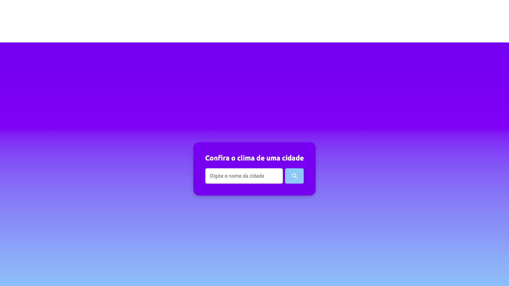

# Indice

- [Sobre](#-sobre)
- [Tecnologias](#Tecnologias)
- [Como baixar o projeto](#-como-baixar-o-projeto)

## 🔖&nbsp; Sobre

Home page simples com consulta a api de clima, feita para fixação de conteúdo didático.

---

## Tecnologias

Esse projeto foi desenvolvido com as seguintes tecnologias:

- [HTML5](https://facebook.github.io/react-native/)
- [JavaScript](https://developer.mozilla.org/en-US/)
- [CSS3](https://firebase.google.com/)

## Como baixar o projeto

[Clique aqui](.github/Controle-Financeiro.apk)

---

<h3 align="center" >Vamos nos conectar 😉</h3>

  &ensp;
  &ensp;
  

 

    Desenvolvido 🚀 por William Pereira Da Conceição

